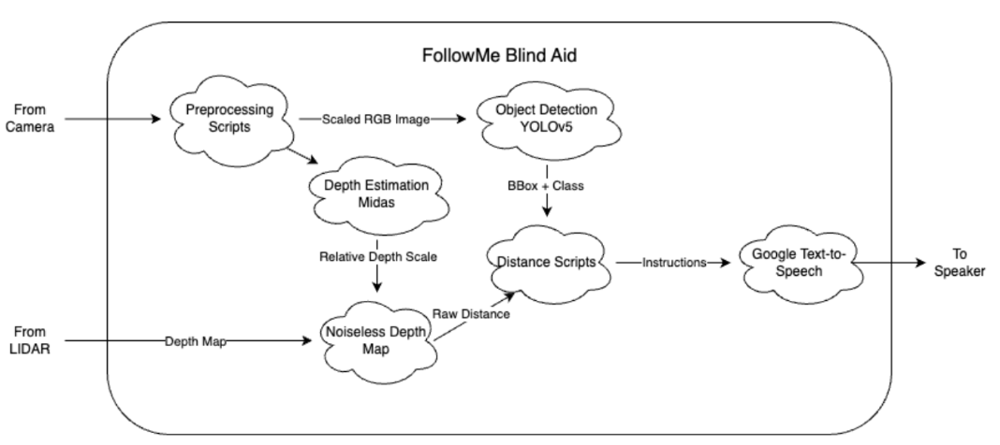
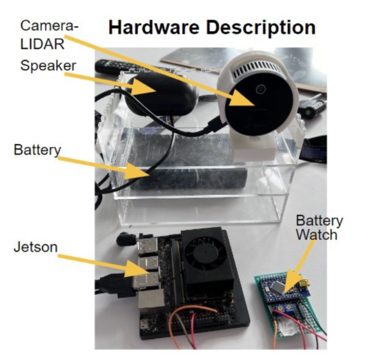
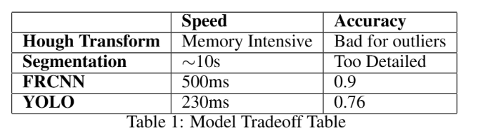
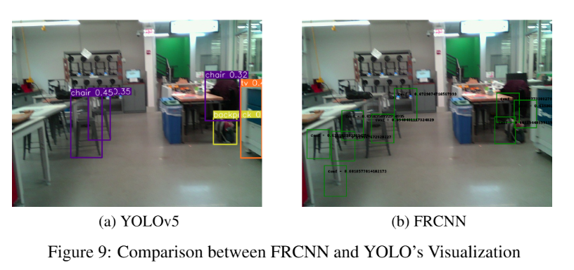
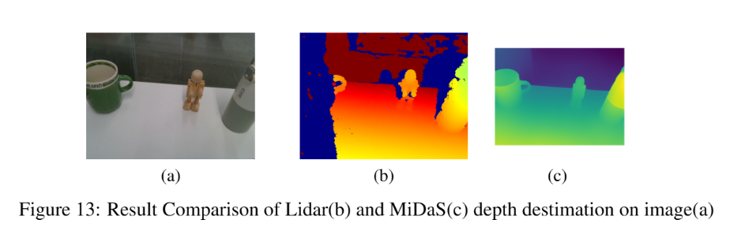

# FollowMe: Real-Time Assistive Vision System

FollowMe is an end-to-end assistive perception system designed to help visually impaired users navigate indoor hallways through real-time obstacle detection, distance estimation, and audio feedback.  
**For detailed system design, experiments, and evaluations, please refer to the full report:**  
[`followme_report.pdf`](./followme_report.pdf)

## Overview

FollowMe focuses on **real-time obstacle awareness** in indoor, flat hallway environments.  
The system integrates object detection, depth estimation, and post-processing logic to provide reliable voice guidance while maintaining low latency on embedded hardware.

The project emphasizes practical trade-offs between **accuracy, robustness, and inference speed**, targeting real-world usability rather than isolated model performance.

## Hardware and methods

Methods:

Our hardware:

## System Pipeline

The system follows a multi-stage perception pipeline:

1. **RGB and depth acquisition** from camera and LiDAR sensors  
2. **Object detection** to identify obstacle classes and locations  
3. **Depth estimation and fusion** to compute reliable object distances  
4. **Post-processing** to filter unstable or implausible detections  
5. **Text-to-speech output** to provide real-time auditory feedback  

This design enables robust perception even when raw depth measurements are noisy.

## Object Detection Module

- Based on **YOLOv5**, selected for its balance between speed and accuracy
- Combines:
  - A **pre-trained lightweight YOLO model** for general objects
  - A **self-trained YOLO model** for hallway-specific objects (e.g., doors, desks, windows)
- Uses **focal loss** to address severe class imbalance in the custom dataset
- Designed to run efficiently on embedded GPUs

A comparison against Faster R-CNN demonstrates that YOLO provides significantly lower latency while maintaining acceptable accuracy for nearby obstacles.

## Depth Estimation Module

- Uses **MiDaS** to generate a smooth, relative depth map from RGB images
- Combines MiDaS output with **LiDAR absolute depth** to:
  - Reduce noise
  - Reliably locate the closest point of an object
- Depth fusion improves distance estimation accuracy compared to using LiDAR alone

## Post-Processing and Robustness

To improve stability and usability, several post-processing strategies are applied:

- **Whitelisting** to remove implausible object classes in hallway environments
- **Occurrence counting** to suppress transient false positives
- **Pixel selection** to reduce depth noise and computation cost

These techniques significantly improve system-level accuracy and reliability.

## Results

- **Overall system accuracy:** ~85%
- **Average end-to-end latency:** ~120 ms
- **Worst-case latency:** ~230 ms
- Evaluated across multiple real indoor hallway environments
- Maintains real-time performance on embedded hardware

Qualitative results show stable detection, accurate distance estimation, and reliable audio feedback.

## Hardware Setup

- RGB camera + LiDAR (Intel RealSense L515)
- NVIDIA Jetson Xavier NX
- Speaker for real-time voice output

The system is designed to be portable and energy-efficient for extended use.