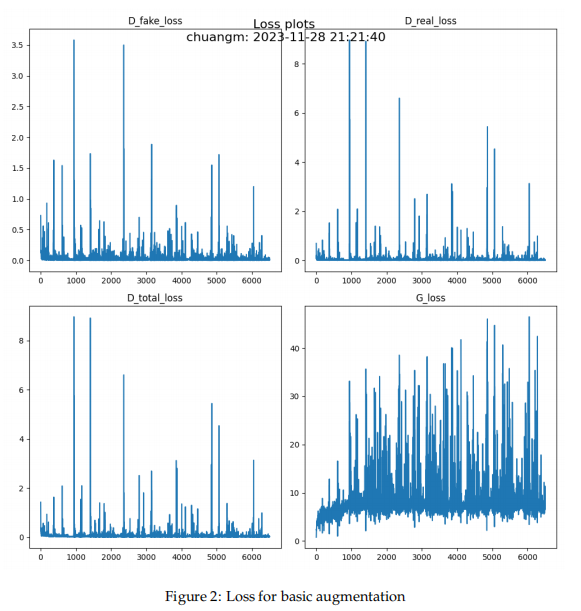
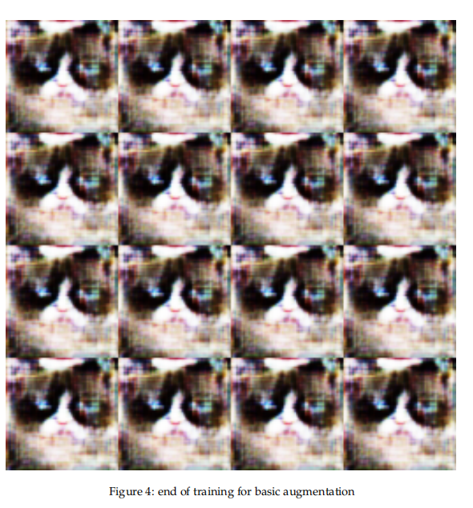
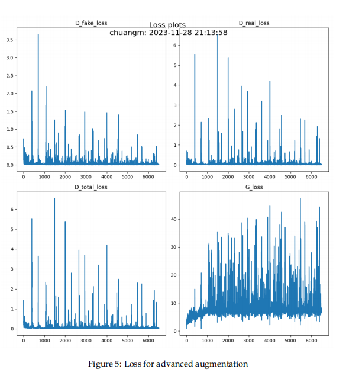

# Image Generation with Generative Adversarial Networks

This project implements and extends Generative Adversarial Networks (GANs) for image synthesis, focusing on training stability and visual quality.  
**For detailed architecture design, training procedures, and experimental results, please refer to the report:**  
[`GAN_report.pdf`](./GAN_report.pdf)

## Overview

This project explores **deep generative modeling** through hands-on implementation of **Deep Convolutional GANs (DCGANs)**.  
The work emphasizes understanding the adversarial training dynamics and addressing common challenges such as mode collapse, vanishing gradients, and discriminator overfitting.

Experiments are conducted on small-scale image datasets to highlight the impact of architectural and training choices.

## Results

Basic augmentation:

Advanced augmentation:

Check [`GAN_report.pdf`](./GAN_report.pdf) for more results.

## Model Architecture

The baseline model follows the DCGAN design with key modifications:

- **Convolutional discriminator** for real/fake classification
- **Upsampling + convolution generator** (instead of transposed convolution)
- **Instance normalization** for improved training stability
- Fully convolutional design without dense layers

Both the generator and discriminator are implemented from scratch.

## Training Strategy

- Alternating optimization of generator and discriminator
- Binary adversarial loss
- Careful initialization and normalization
- Comparison between:
  - **Basic data augmentation**
  - **Advanced data augmentation** (random crops, flips)

Training dynamics are analyzed through loss curves and intermediate generation results.

## Architectural Improvements

To improve convergence and sample quality, residual connections are introduced:

- Residual blocks added to the **generator only**
- Residual blocks added to **both generator and discriminator**

These modifications help mitigate vanishing gradients and enable more stable adversarial training.
