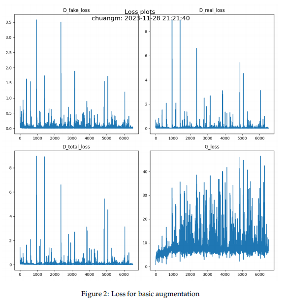
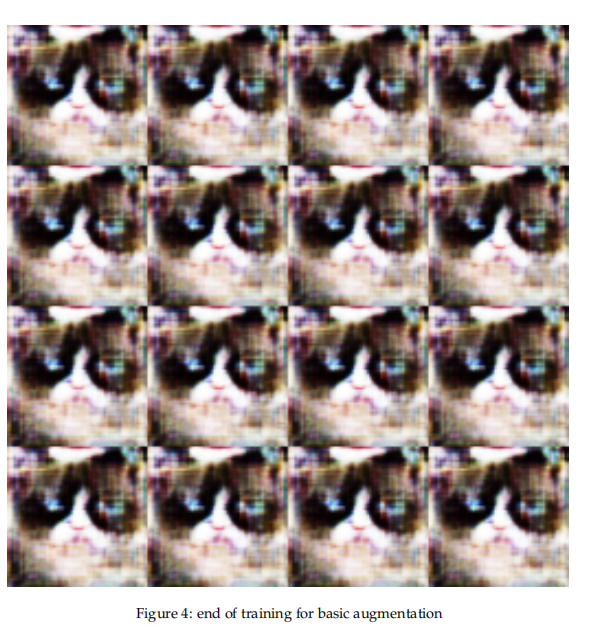
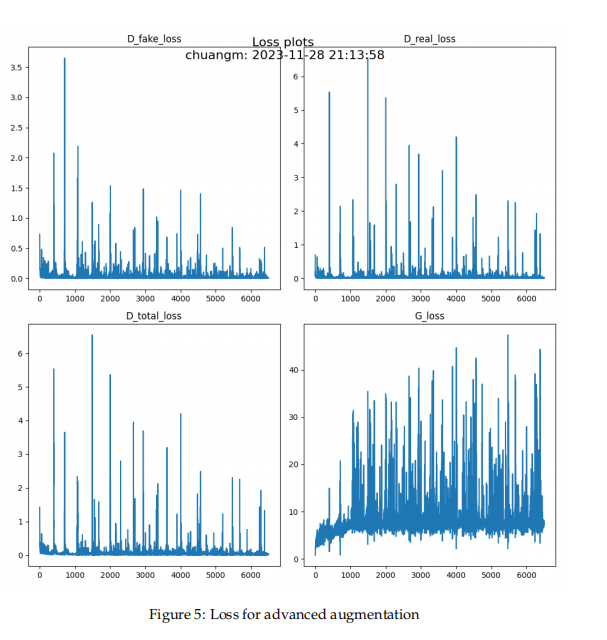
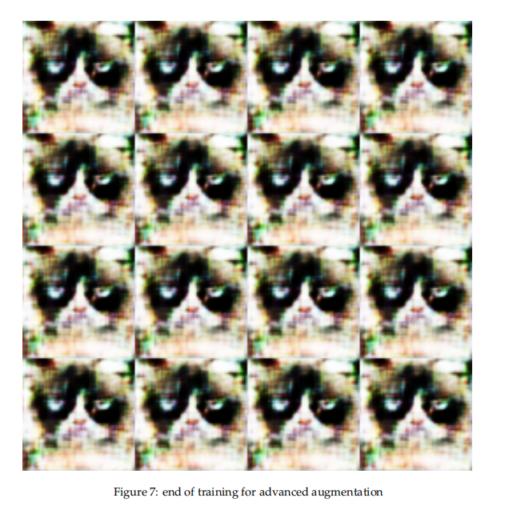

# Image Generation with Generative Adversarial Networks

This project implements and extends **Generative Adversarial Networks (GANs)** for image synthesis, with a focus on **training stability**, **architectural design**, and **visual quality**.

**For detailed architecture explanations, training procedures, and experimental analysis, please refer to:**  
[`GAN_report.pdf`](./GAN_report.pdf)

---

## Overview

This project explores **deep generative modeling** through a from-scratch implementation of **Deep Convolutional GANs (DCGANs)**.

The core objective is to understand how adversarial training enables image generation from noise, and how architectural and training choices influence:

- Training stability
- Convergence behavior
- Quality and diversity of generated samples

Experiments are conducted on small-scale image datasets to clearly demonstrate these effects.

---

## Results

**Basic augmentation:**

**Advanced augmentation:**

Additional qualitative results and loss curves can be found in  
[`GAN_report.pdf`](./GAN_report.pdf)

---

## Model Architecture

The baseline model follows the **DCGAN** paradigm with several deliberate design choices:

- **Fully convolutional discriminator** for real/fake classification
- **Generator based on upsampling + convolution**  
  (instead of transposed convolution)
- **Instance normalization** to improve stability under small batch sizes
- Progressive spatial generation from low to high resolution

The generator first maps a low-dimensional noise vector to a **low-resolution spatial representation**, then gradually refines structure and details through successive upsampling stages.

Both the generator and discriminator are implemented entirely from scratch.

---

## Training Strategy

- Alternating optimization of **discriminator** and **generator**
- Binary adversarial loss with logits
- Fixed noise vectors for qualitative progress tracking
- Comparison between:
  - **Basic data augmentation**
  - **Advanced data augmentation** (random crops, flips)

Training dynamics are monitored using loss curves and intermediate generated samples.

---

## Architectural Improvements

To further improve convergence and visual quality, **residual connections** are introduced:

- Residual blocks added to the **generator only**
- Residual blocks added to **both generator and discriminator**

These modifications improve gradient flow and reduce training instability commonly observed in GANs, leading to more consistent and higher-quality image generation.
