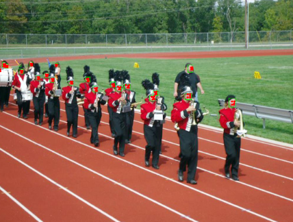
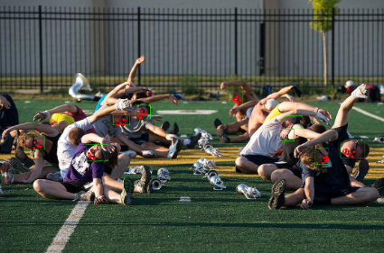
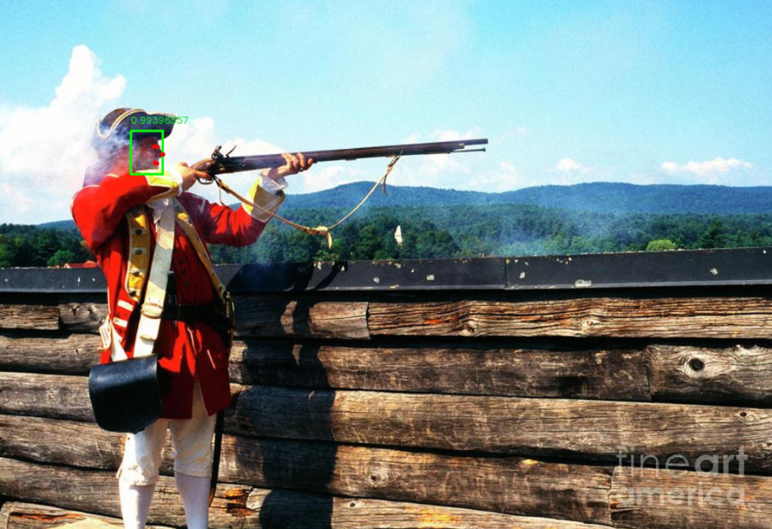

# Face Detection with Deep Learning

A complete **anchor-based face detection system** covering **data analysis, model design, training, and inference**, implemented with engineering practices used in real-world face detectors.

**Full technical report:** [`face_detection_report.pdf`](./face_detection_report.pdf)

---

## Overview

This project implements a **single-stage, fully convolutional face detector** inspired by **region-based detection principles (Fast R-CNN)** while achieving high efficiency through **dense anchors and multi-scale feature pyramids**.

Key ideas:
- Anchors act as implicit region proposals
- Multi-scale features enable robust detection of faces at different sizes
- Joint learning of classification, box regression, and facial landmarks

---

## Detection Results

---

## Detection Pipeline

- **Shared convolutional backbone** extracts hierarchical features  
- **Feature Pyramid Network (FPN)** aggregates multi-scale representations  
- **Dense anchors** generate region candidates at each spatial location  
- **Multi-head predictions** perform:
  - Face / background classification
  - Bounding box regression
  - Facial landmark regression
- **Post-processing (thresholding + NMS)** produces final detections

This design combines **Fast R-CNN-style region reasoning** with modern **single-stage detection efficiency**.

---

## Model Architecture

- **ResNet-50 Backbone**  
  Extracts deep semantic features

- **FPN (Feature Pyramid Network)**  
  Fuses low-level spatial detail with high-level semantics for multi-scale detection

- **SSH Context Modules**  
  Multi-branch convolutions with different effective receptive fields  
  - Enhance contextual information without pooling or downsampling  
  - Preserve spatial resolution and anchor alignment  
  - Especially effective for small and occluded faces

- **Detection Heads**  
  Each anchor predicts:
  - Binary classification (face / background)
  - Bounding box offsets
  - Five facial landmarks

---

## Training & Inference Highlights

- **Anchor Matching:** IoU-based assignment with guaranteed positive matches  
- **Class Imbalance Handling:** Hard Negative Mining  
- **Loss Function:**  
  - Classification loss (cross-entropy)  
  - Box regression loss (Smooth L1)  
  - Landmark regression loss (Smooth L1 on positive anchors only)
- **Inference:** Anchor decoding → confidence filtering → Non-Maximum Suppression (NMS)

---

## Summary

This project demonstrates how **region-based detection concepts**, **multi-scale feature design**, and **anchor-based dense prediction** are integrated into a practical and efficient face detection system.

