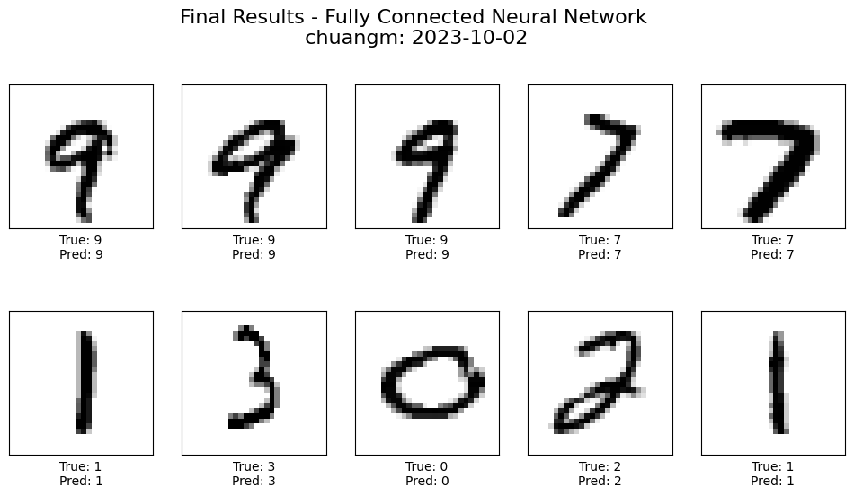
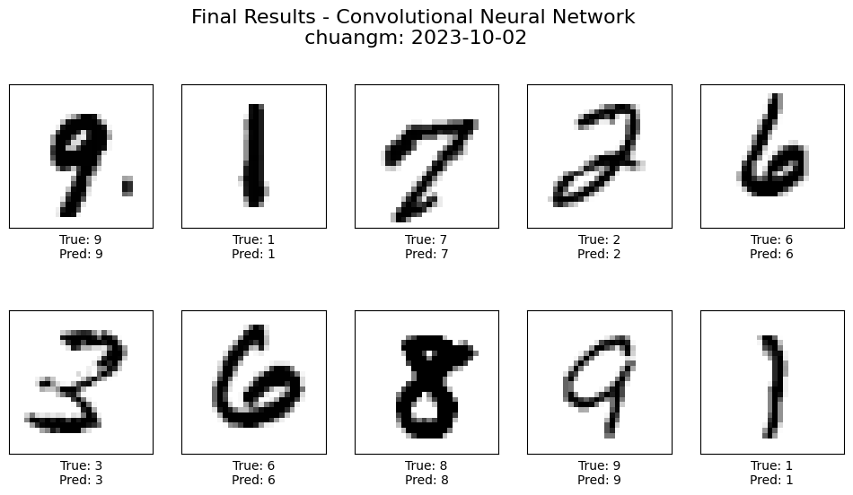
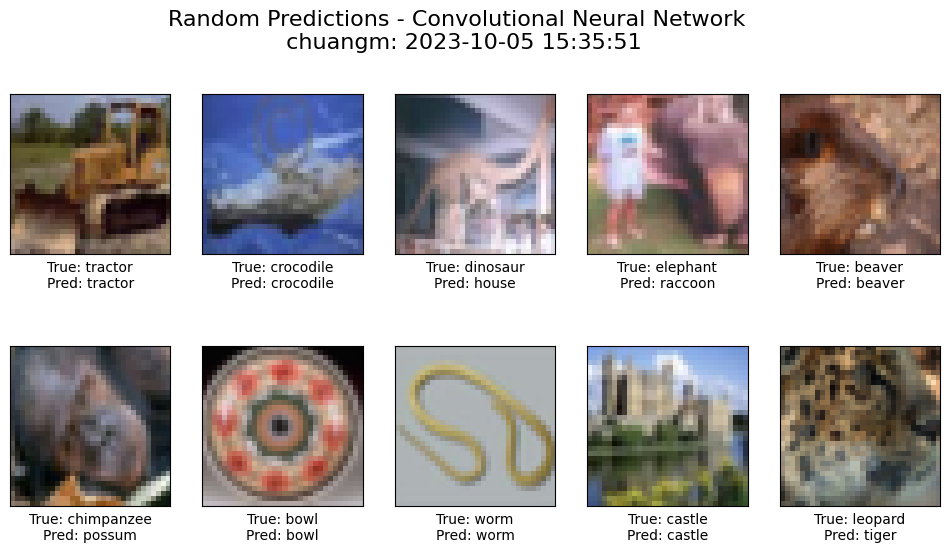
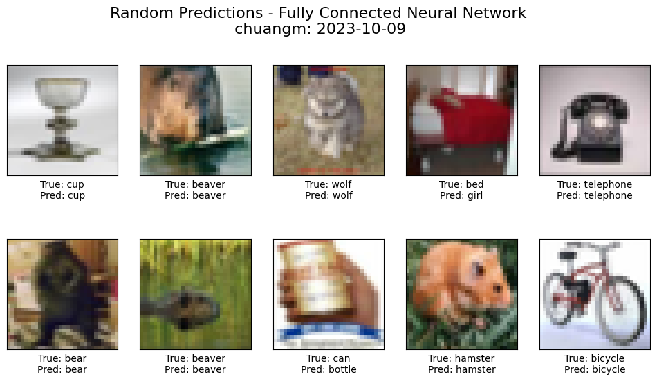

# Image Classification with Deep Learning

This project explores deep learning–based image classification using fully connected networks and convolutional neural networks (CNNs).  
**Detailed methodology, experiments, and analysis can be found in the full report:**  
[`image_classification_report.pdf`](./image_classification_report.pdf)

## Overview

The project covers image and object classification across two benchmark datasets:
- **MNIST**: handwritten digit classification
- **CIFAR-100**: fine-grained object classification with 100 categories

Models are implemented from scratch in PyTorch and progressively improved through architectural design choices and systematic fine-tuning.

## Results

- **MNIST**
  - FCN accuracy: ~94%
  
  - CNN accuracy: ~98%
  
- **CIFAR-100**
  - Baseline CNN accuracy: ~45%
  
  - Fine-tuned CNN accuracy: **~61%**
  

Check [`image_classification_report.pdf`](./image_classification_report.pdf) for more results and loss plots.

Performance trends, overfitting behavior, and architectural trade-offs are analyzed in detail in the report.

## Key Components

- Fully Connected Neural Networks (FCN)
- Convolutional Neural Networks (CNN)
- Custom cross-entropy loss implementation
- Training and evaluation pipelines
- Feature visualization using t-SNE
- Fine-tuning strategies for performance improvement