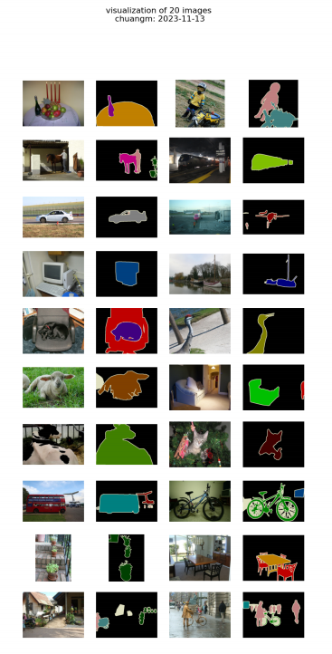
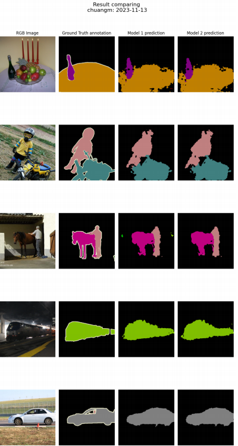
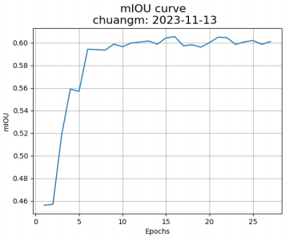
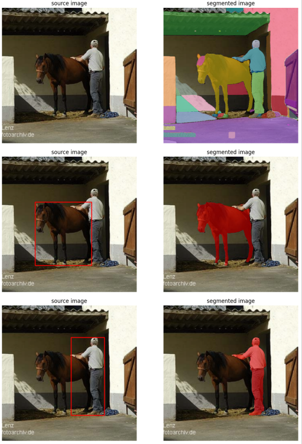

# Semantic Segmentation with Deep Learning

This project implements a semantic segmentation system based on DeepLab architectures, covering data preparation, network design, training, evaluation, and qualitative analysis.  
**For full implementation details, experiments, and analysis, please refer to the report:**  
[`semantic_segmentation_report.pdf`](./semantic_segmentation_report.pdf)

## Overview

This project focuses on **pixel-level semantic understanding**, where each pixel in an image is assigned a semantic category.  
The implementation follows the **DeepLabV3 / DeepLabV3+** design philosophy, emphasizing multi-scale context aggregation and high-resolution prediction.

Experiments are conducted on the Pascal VOC dataset, and results are evaluated using mean Intersection-over-Union (mIoU).

## Results

Some visulization:

Comparing:

- Stable convergence of DeepLabV3+ during training
- Best mIoU achieved around **~0.60** on the validation set

- Improved boundary quality and class consistency when using DeepLabV3+
- Side-by-side visualization of RGB images, ground truth masks, and model predictions

## Model Architecture

The segmentation network is built around the following components:

- **ResNet-50 backbone** (ImageNet pretrained)
- **Atrous Spatial Pyramid Pooling (ASPP)** for multi-scale context modeling
- **DeepLabV3 head** for high-level semantic prediction
- **DeepLabV3+ head**, which additionally incorporates low-level features for sharper object boundaries

The comparison between DeepLabV3 and DeepLabV3+ highlights the impact of combining low-level spatial details with high-level semantic features.

## Training and Optimization

- Backbone learning rate scaled to **0.1×** of the main learning rate
- Step-based learning rate scheduler
- Standard **Cross-Entropy Loss**
- Alternative loss functions explored to address **class imbalance**, inspired by detection tasks
- Performance monitored using **mIoU**, which better reflects segmentation quality than pixel accuracy

## Segment Anything Model (SAM) Comparison

In addition to supervised semantic segmentation, the project evaluates the **Segment Anything Model (SAM)** on the same images:

- Semantic segmentation predicts **class-aware pixel labels**
- SAM produces **class-agnostic object masks** without task-specific training
- The comparison highlights trade-offs between supervised, task-specific models and large-scale foundation models

SAM model:

