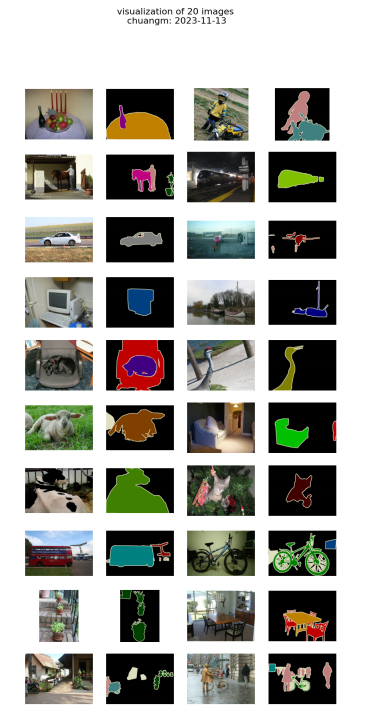
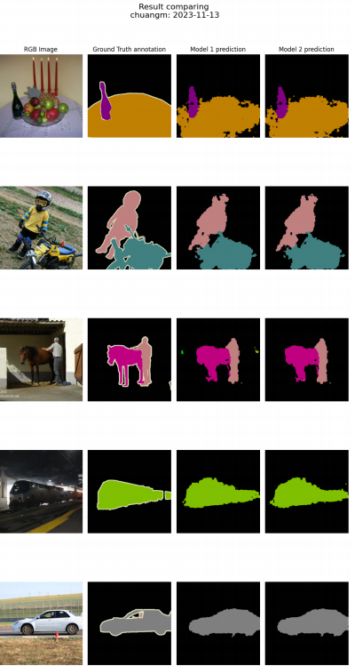
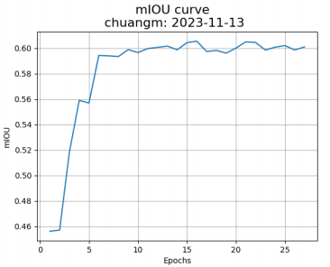
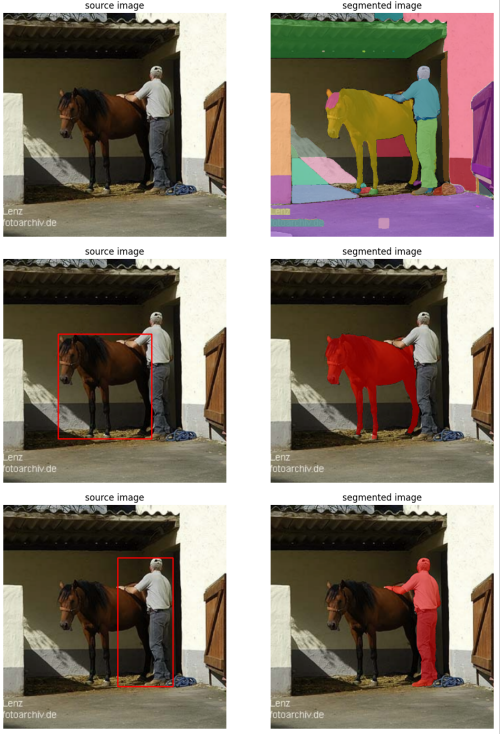

# Semantic Segmentation

This project implements a **semantic segmentation pipeline** based on **DeepLabV3 / DeepLabV3+**, focusing on **dense pixel-level prediction** and multi-scale semantic understanding.

For detailed experiments and analysis, please refer to:  
[`semantic_segmentation_report.pdf`](./semantic_segmentation_report.pdf)

---

## Overview

Semantic segmentation aims to assign a **semantic class to every pixel** in an image.  
This project follows the DeepLab design principles:

- Dense prediction on feature maps
- Atrous (dilated) convolution to enlarge receptive fields without downsampling
- Multi-scale context modeling using ASPP
- High-resolution output via upsampling and feature fusion

Experiments are conducted on **Pascal VOC**, evaluated using **mean Intersection-over-Union (mIoU)**.

---

## Results

Visualization examples:

Comparison between predictions:

- Stable training convergence
- Best validation **mIoU ≈ 0.60**
- DeepLabV3+ shows improved boundary quality

---

## Model Architecture

The network consists of:

- **ResNet-50 backbone** (ImageNet pretrained)
- **ASPP (Atrous Spatial Pyramid Pooling)** for multi-scale context aggregation
- **DeepLabV3 head** for semantic classification
- **DeepLabV3+ head** with low-level feature fusion for sharper boundaries

---

## Training and Evaluation

- Backbone learning rate set to **0.1×** of the main learning rate
- Step-based learning rate scheduler
- **Cross-Entropy Loss** as baseline
- Alternative losses explored to mitigate **class imbalance**
- Performance measured using **mIoU**, which balances per-class segmentation quality

---

## Segment Anything Model (SAM) Comparison

A qualitative comparison with **SAM** highlights:

- DeepLab: **class-aware dense prediction**
- SAM: **class-agnostic object masks**
- Trade-offs between supervised task-specific models and foundation models

